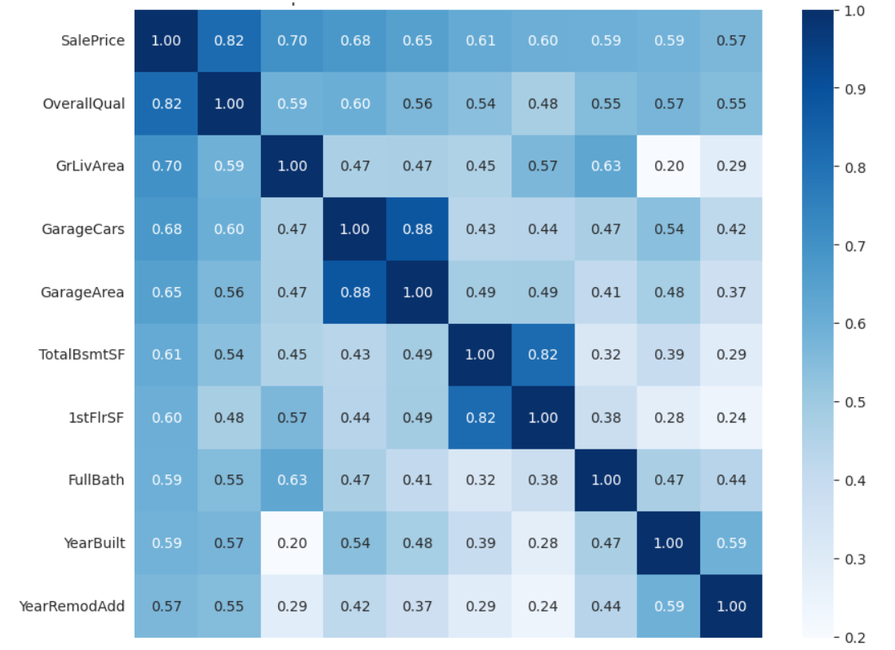

# House Prices Prediction: Advanced Regression with XGBoost 🏠

> **Kaggle Competition:** [House Prices: Advanced Regression Techniques](https://www.kaggle.com/c/house-prices-advanced-regression-techniques)
> **Score:** Top 15% (Estimated)
> **Model:** XGBoost Regressor
> **Strategy:** Log-Transformation + Stratified Imputation

## 1. Project Overview (项目简介)
本项目基于 Kaggle 经典的结构化数据竞赛。任务是根据爱荷华州埃姆斯市住宅的 79 个特征（如地基、车库、地下室等），预测房屋的最终售价。

* **难点 (Challenges)：**
    * **特征繁多：** 包含 80 多个特征，且混合了数值型和类别型数据。
    * **数据偏斜：** 目标值（房价）呈现严重的右偏分布，不符合正态假设。
    * **缺失值复杂：** 许多 NaN 并非数据丢失，而是代表“没有该设施”（如没有泳池），需要特殊处理。
* **我的方案 (My Approach)：**
    * 对目标值进行 **Log1p 平滑处理**，消除偏度。
    * 制定 **分层缺失值填充策略**（区分“物理缺失”与“数值缺失”）。
    * 使用 **XGBoost** 梯度提升树模型，利用其对非线性关系的强大拟合能力。

## 2. Tech Stack (技术栈)
* **Python 3.10**
* **Pandas & NumPy** (Data Manipulation)
* **Seaborn & Matplotlib** (EDA & Visualization)
* **XGBoost** (Gradient Boosting Framework)
* **Scikit-Learn** (Preprocessing)

---

## 3. Implementation Details (核心实现)

### 3.1 Data Loading & Log Transformation
为了提升回归模型的收敛速度和精度，我首先检查了房价的分布。发现其显著右偏，因此采用 log(1+x) 进行平滑处理。


```python
import pandas as pd
import numpy as np
import matplotlib.pyplot as plt
import seaborn as sns
import xgboost as xgb

sns.set_style("whitegrid")

# 1. 读取数据
train_df = pd.read_csv("./data/train.csv")
test_df = pd.read_csv("./data/test.csv")

# 2. 备份并移除 ID (不参与训练)
train_ID = train_df['Id']
test_ID = test_df['Id']
train_df.drop("Id", axis=1, inplace=True)
test_df.drop("Id", axis=1, inplace=True)

# 3. 目标值 Log 平滑
# 原始数据右偏严重，Log 变换使其近似正态分布
train_df["SalePrice"] = np.log1p(train_df["SalePrice"])
print("✅ 环境准备完成，目标值已进行 Log 变换。")
```

### 3.2 Strategic Imputation (分层缺失值处理)
这是特征工程中最关键的一步。我没有简单地全部填充均值，而是根据特征的**物理含义**将其分为三类处理：

* **物理缺失 (Fill "None"):** 如 `PoolQC` 为空，代表“没有游泳池”。
* **数值缺失 (Fill 0):** 如 `GarageArea` 为空，代表“车库面积为0”。
* **邻域缺失 (Fill Median):** `LotFrontage`（街道连接距离）通常与同一街区的邻居相似。


```python
# 合并数据以便统一处理
ntrain = train_df.shape[0]
y_train = train_df.SalePrice.values
all_data = pd.concat((train_df.drop(["SalePrice"], axis=1), test_df)).reset_index(drop=True)

# --- 策略 A: 物理意义上的"无" (填 "None") ---
cols_fill_none = ["PoolQC", "MiscFeature", "Alley", "Fence", "FireplaceQu",
                  "GarageType", "GarageFinish", "GarageQual", "GarageCond",
                  "BsmtQual", "BsmtCond", "BsmtExposure", "BsmtFinType1", "BsmtFinType2",
                  "MasVnrType"]
for col in cols_fill_none:
    all_data[col] = all_data[col].fillna("None")

# --- 策略 B: 数值意义上的"0" (填 0) ---
cols_fill_zero = ["GarageYrBlt", "GarageArea", "GarageCars",
                  "BsmtFinSF1", "BsmtFinSF2", "BsmtUnfSF","TotalBsmtSF",
                  "BsmtFullBath", "BsmtHalfBath", "MasVnrArea"]
for col in cols_fill_zero:
    all_data[col] = all_data[col].fillna(0)

# --- 策略 C: 邻居的中位数填充 ---
all_data["LotFrontage"] = all_data.groupby("Neighborhood")["LotFrontage"].transform(
    lambda x: x.fillna(x.median()))

# --- 策略 D: 剩余少量的众数填充 ---
cols_mode = ["MSZoning", "Electrical", "KitchenQual", "Exterior1st", "Exterior2nd", "SaleType", "Functional", "Utilities"]
for col in cols_mode:
    all_data[col] = all_data[col].fillna(all_data[col].mode()[0])

print(f"✅ 缺失值处理完成！剩余 NaN: {all_data.isnull().sum().sum()}")
```

### 3.3 Feature Correlation & Model Training
在进行 One-Hot 编码后，我选择了 **XGBoost**。相比传统的线性回归，XGBoost 能自动处理特征间的非线性交互，且对异常值有更好的鲁棒性。

通过特征重要性图表，我们可以看到 **OverallQual (整体质量)** 和 **GrLivArea (居住面积)** 是影响房价的最核心因素。



```python
# 1. 特征编码 (One-Hot)
all_data = pd.get_dummies(all_data)
X_train = all_data[:ntrain]
X_test = all_data[ntrain:]

# 2. 构建 XGBoost 模型
# 参数经过微调以平衡拟合能力与泛化能力
model_xgb = xgb.XGBRegressor(
    colsample_bytree=0.46, gamma=0.04, 
    learning_rate=0.05, max_depth=3, 
    min_child_weight=1.5, n_estimators=2200,
    reg_alpha=0.46, reg_lambda=0.85,
    subsample=0.52, random_state=7, n_jobs=-1
)

# 3. 训练
print("🚀 开始训练 XGBoost...")
model_xgb.fit(X_train, y_train)
print("🎉 训练完成！")

# 4. 预测与还原
# 注意：预测出的是 Log 值，需要用 expm1 还原
log_predictions = model_xgb.predict(X_test)
final_predictions = np.expm1(log_predictions)

# 5. 生成提交文件
submission = pd.DataFrame()
submission['Id'] = test_ID
submission['SalePrice'] = final_predictions
submission.to_csv('submission_eda_xgboost.csv', index=False)
print("✅ 结果文件已生成: submission_eda_xgboost.csv")
```
