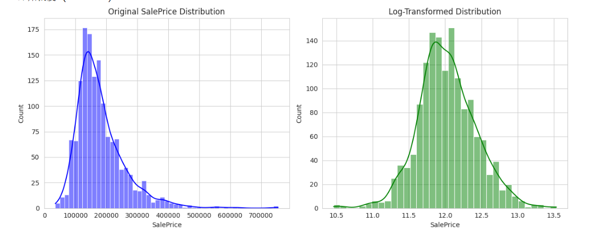
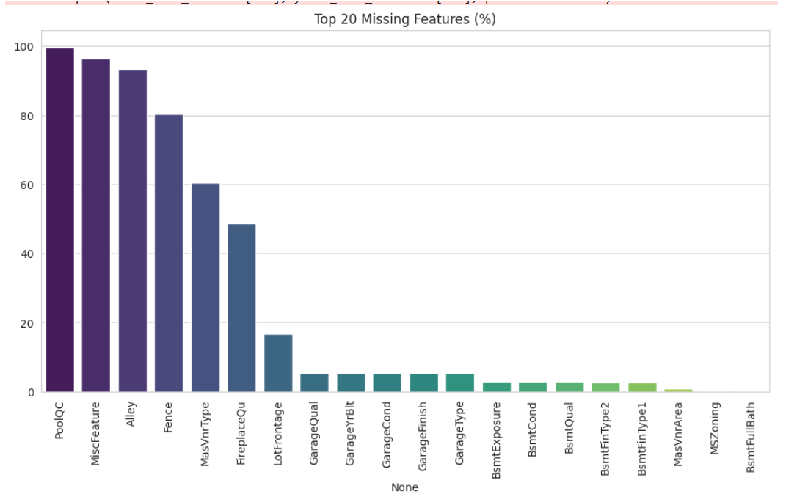

# 🏠 Kaggle 实战：基于 XGBoost 的房价预测 (完整流程)

> **项目背景**：[House Prices: Advanced Regression Techniques](https://www.kaggle.com/c/house-prices-advanced-regression-techniques)
> **核心策略**：细致的 EDA、分层缺失值填充、Log 目标值平滑、XGBoost 回归。

## 📋 目录
1. [Step 1: 环境与数据读取](#step-1)
2. [Step 2-3: 目标值分析与 Log 变换](#step-2)
3. [Step 4-5: 缺失值处理 (核心策略)](#step-4)
4. [Step 6: 特征相关性分析](#step-6)
5. [Step 7-9: 编码、训练与提交](#step-7)

---

## Step 1: 环境与数据读取 <a name="step-1"></a>

导入必要的库，读取数据，并提前剥离 ID 列。

```python
import pandas as pd
import numpy as np
import matplotlib.pyplot as plt
import seaborn as sns
import xgboost as xgb

# 设置绘图风格
sns.set_style("whitegrid")

# 读取数据
train_df = pd.read_csv("./data/train.csv")
test_df = pd.read_csv("./data/test.csv")

# 备份 ID 用于提交，删除训练数据中的 ID
train_ID = train_df['Id']
test_ID = test_df['Id']
train_df.drop("Id", axis=1, inplace=True)
test_df.drop("Id", axis=1, inplace=True)

print(f"✅ 数据读取完成！训练集形状: {train_df.shape}")
```

---

## Step 2-3: 目标值分析与 Log 变换 <a name="step-2"></a>

原始房价呈现**右偏分布**。为了让模型更好地训练，我们对 `SalePrice` 执行 `log1p` 平滑处理。



```python
# --- 可视化对比 (Step 2) ---
plt.figure(figsize=(12, 5))
plt.subplot(1, 2, 1)
sns.histplot(train_df['SalePrice'], kde=True, color='blue')
plt.title('Original SalePrice Distribution')

plt.subplot(1, 2, 2)
sns.histplot(np.log1p(train_df['SalePrice']), kde=True, color='green')
plt.title('Log-Transformed Distribution')
plt.show()

# --- 执行 Log 变换 (Step 3) ---
train_df["SalePrice"] = np.log1p(train_df["SalePrice"])
print("✅ 目标值 SalePrice 已完成 Log 平滑处理。")
```

---

## Step 4-5: 缺失值处理 (核心策略) <a name="step-4"></a>

这是提升分数的关键。我们不盲目填充众数，而是根据**物理含义**分层处理。



```python
# 合并数据以便统一分析
ntrain = train_df.shape[0]
ntest = test_df.shape[0]
y_train = train_df.SalePrice.values
all_data = pd.concat((train_df.drop(["SalePrice"], axis=1), test_df)).reset_index(drop=True)

# ----------------------------------------------------
# 策略 A: 物理上不存在 (填 "None")
# 例如：没有泳池(PoolQC)、没有地下室(Bsmt...)
cols_fill_none = ["PoolQC", "MiscFeature", "Alley", "Fence", "FireplaceQu",
                  "GarageType", "GarageFinish", "GarageQual", "GarageCond",
                  "BsmtQual", "BsmtCond", "BsmtExposure", "BsmtFinType1", "BsmtFinType2",
                  "MasVnrType"]
for col in cols_fill_none:
    all_data[col] = all_data[col].fillna("None")

# 策略 B: 数值上不存在 (填 0)
# 例如：没有车库，面积(GarageArea)自然是0
cols_fill_zero = ["GarageYrBlt", "GarageArea", "GarageCars",
                  "BsmtFinSF1", "BsmtFinSF2", "BsmtUnfSF","TotalBsmtSF",
                  "BsmtFullBath", "BsmtHalfBath", "MasVnrArea"]
for col in cols_fill_zero:
    all_data[col] = all_data[col].fillna(0)

# 策略 C: 邻居填充 (LotFrontage)
# 街道连接距离通常和同一个街区的邻居相似
all_data["LotFrontage"] = all_data.groupby("Neighborhood")["LotFrontage"].transform(
    lambda x: x.fillna(x.median()))

# 策略 D: 众数填充 (真正的遗漏数据)
cols_mode = ["MSZoning", "Electrical", "KitchenQual", "Exterior1st", "Exterior2nd", "SaleType", "Functional"]
for col in cols_mode:
    all_data[col] = all_data[col].fillna(all_data[col].mode()[0])

# 补丁：Utilities 只有2个缺失
all_data['Utilities'] = all_data['Utilities'].fillna(all_data['Utilities'].mode()[0])

print(f"✅ 数据清洗完成！剩余缺失值: {all_data.isnull().sum().sum()}")
```

---

## Step 6: 特征相关性分析 <a name="step-6"></a>

通过热力图查看哪些数值型特征与房价最相关。


```python
# 只分析数字型特征
corrmat = train_df.corr(numeric_only=True)
k = 10 
cols = corrmat.nlargest(k, 'SalePrice')['SalePrice'].index
cm = np.corrcoef(train_df[cols].values.T)

# 绘图代码略（见源码）
print(f"Top 10 相关特征: {list(cols)}")
```

---

## Step 7-9: 编码、训练与提交 <a name="step-7"></a>

使用 One-Hot 编码处理分类特征，并使用经过参数调优的 **XGBoost** 进行训练。

```python
# --- Step 7: 独热编码 ---
all_data = pd.get_dummies(all_data)
print(f"编码后特征总数: {all_data.shape[1]}")

# 重新拆分
X_train = all_data[:ntrain]
X_test = all_data[ntrain:]

# --- Step 8: XGBoost 训练 ---
# 参数已针对数据集微调
model_xgb = xgb.XGBRegressor(
    colsample_bytree=0.46, gamma=0.04, 
    learning_rate=0.05, max_depth=3, 
    min_child_weight=1.5, n_estimators=2200,
    reg_alpha=0.46, reg_lambda=0.85,
    subsample=0.52, random_state=7, n_jobs=-1
)

print("🚀 开始训练 XGBoost...")
model_xgb.fit(X_train, y_train)
print("🎉 训练完成！")

# --- Step 9: 生成提交 ---
log_predictions = model_xgb.predict(X_test)
final_predictions = np.expm1(log_predictions) # 别忘了还原 log

submission = pd.DataFrame()
submission['Id'] = test_ID
submission['SalePrice'] = final_predictions
submission.to_csv('submission_eda_xgboost.csv', index=False)
print("✅ 文件已生成：submission_eda_xgboost.csv")
```
